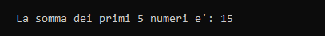

# Recursive sum number

Implementazione ricorsiva dell'algoritmo che somma i primi numeri naturali (da 0 a n).

## Componenti della ricorsione
1. **Condizioni di terminazione:** `if (n <= 0)`
2. **Istruzione di terminazione:** `return 0`
3. **Passo di avvicinamento:** `n-1`
4. **Chiamata ricorsiva:** `return n + som_num(n-1)`

## Utilizzo
1. Crea in Code::Blocks un nuovo progetto.
2. Copia il codice sorgente.
3. Compila ed esegui.

## Codice sorgente
```cpp
#include <iostream>

int som_num(int n);

int main()
{
    int numeri = 5;
    int somma = som_num(numeri);

    std::cout << std::endl;
    std::cout << "\tLa somma dei primi " << numeri << " numeri e': " << somma;
    std::cout << std::endl;
    return 0;
}

int som_num(int n){
    if (n <= 0)
        return 0;
    else
        return n + som_num(n-1);
}
```

## Output


## Autore
Gabriele Henriet - [GitHub](https://github.com/Gabri-dev-C)

## Licenza
MIT License
